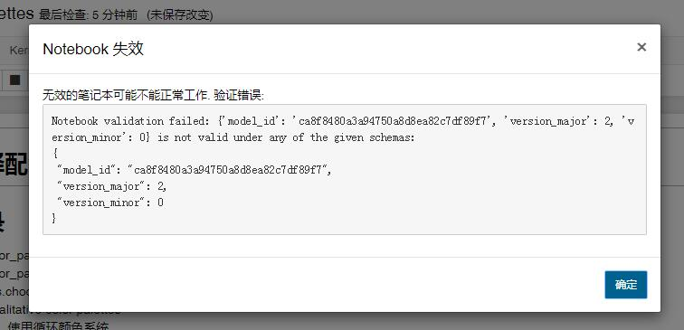
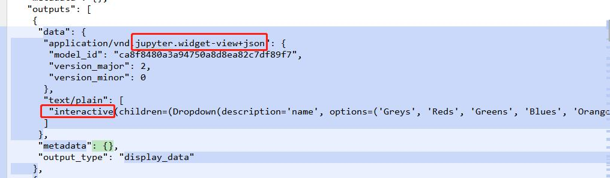
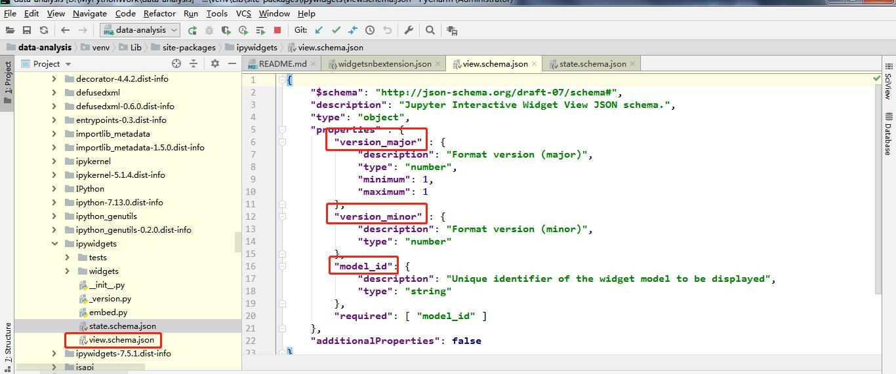
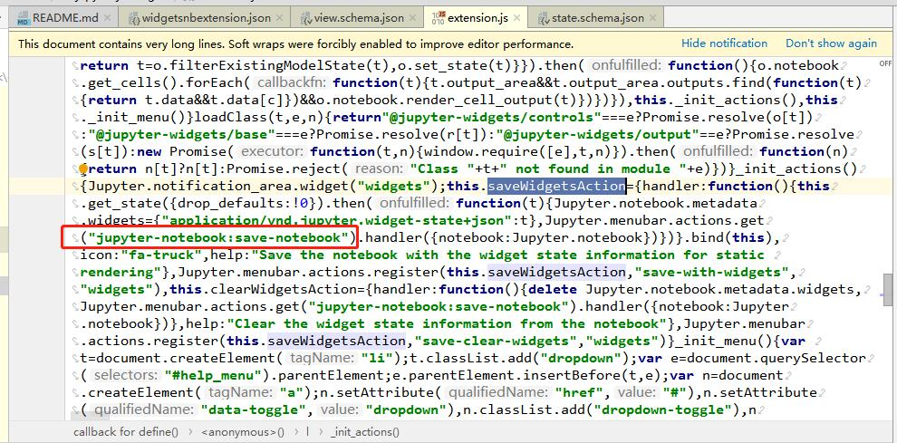
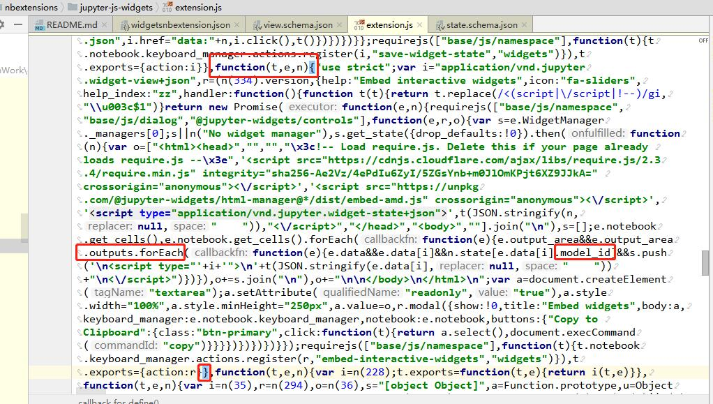

# ipywidgets插件在jupyter中交互式编程的保存验证问题分析

## 原因
&emsp;&emsp;由于seaborn的某些方法采用了交互式的插件ipyweights，导致jupyter保存的时候，报验证错误。

## 问题分析
1. 在文件的ipynb源码里面，有一段data，可能是某个js验证的时候，导致不能通过。

2. 追查到schema文件，觉得可能是在前端加载js的时候，引入了view.schema.json文件。

3. 根据schema文件，可以看到相应的属性在ipynb源码中都有对应，于是查找jupyter的前端加载插件的源码。
  
可以看到这一块是保存状态的地方，猜想可能是生成的时候，进行根据state.schema进行状态校验。
4. 最后按照view关键字进行js文件搜索，查到了在nbextension扩展插件的js文件中，有一个方法，是采用nodejs写的，用于校验。

## 总结
&emsp;&emsp;虽然还是不知道如何解决该问题，但是经过一段源码搜索，明白了jupyter的插件加载和在ipynb里面的数据生成。